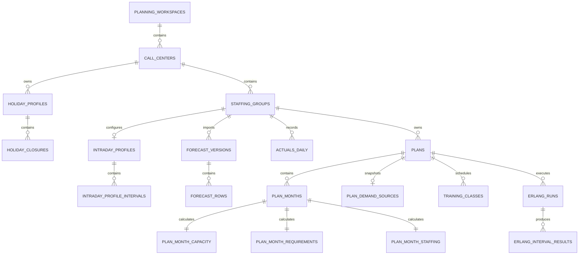

# PostgreSQL Relational Schema

The executable schema is
[`postgresql-schema.sql`](postgresql-schema.sql). It targets PostgreSQL 15 or
newer and implements the persistence contract in `DATA-001`.

# Core Decisions

- PostgreSQL is the system of record.
- Persistent business data is normalized into related tables.
- No business-data column uses JSON, JSONB, arrays, or serialized document
  payloads.
- UUID identifiers use PostgreSQL's built-in `gen_random_uuid()`.
- Percentages are stored as decimal ratios.
- Date-only business values use `date`.
- Local interval timestamps use `timestamp without time zone` and are
  interpreted with the owning call center's IANA time zone.
- Audit timestamps use `timestamptz`.
- Drafts and finalized plans use the same relational tables.
- Finalized plan snapshots are protected by database triggers.

JSON may still be produced as an external backup or API representation. It is
not used as the database storage model.

# Apply

Run against an empty PostgreSQL 15+ database:

```bash
psql "$DATABASE_URL" -v ON_ERROR_STOP=1 \
  -f specs/database/postgresql-schema.sql
```

The script creates the `planning` schema and records schema version `1`.

# Table Groups

| Area | Principal tables |
|---|---|
| Organization | `planning_workspaces`, `call_centers`, `staffing_groups` |
| Calendar | `holiday_profiles`, `holiday_closures`, operating weekday tables |
| Intraday setup | `intraday_profiles`, `intraday_profile_intervals` |
| Forecast imports | `forecast_versions`, `forecast_rows`, mapping, issue, and readiness tables |
| Actuals | `actuals_imports`, `actuals_daily`, mapping and issue tables |
| Plan identity | `plans`, `plan_demand_sources` |
| Immutable snapshots | plan calendar, settings, intraday, daily, and interval snapshot tables |
| Monthly planning | `plan_months`, `plan_month_capacity`, `plan_month_requirements`, `plan_month_staffing` |
| Training | `plan_training_settings`, `training_classes` |
| Erlang | `erlang_runs`, `erlang_interval_results`, `actual_month_requirements` |
| Completeness | `plan_section_reviews`, `plan_issues` |

# Relationship Overview



# Important Database Invariants

- One budget exists at most per staffing group and planning year.
- One finalized plan is current at most per staffing group and year.
- Update lineage remains within one staffing group and planning year.
- A finalized plan requires twelve monthly demand, capacity, requirement, and
  staffing rows.
- Finalization requires complete monthly calculations, reviewed core sections,
  one calendar snapshot, one settings snapshot, and no unresolved blocker.
- Referenced forecast deletion uses the `deleted` lifecycle state rather than
  physical deletion.
- Actuals may be replaced or deleted without mutating copied plan snapshots.
- A valid intraday profile must contain ratios totaling `1.0` within the
  declared tolerance.

# Transaction Boundaries

The implementation shall use one database transaction for:

- accepting or replacing a forecast import
- merging an actuals import
- autosaving a draft and its affected child rows
- applying a forecast snapshot to a plan
- finalizing a plan
- switching the current plan
- deleting a center, group, plan, actuals scope, or workspace
- promoting a completed Erlang run as the current complete result

Use `plans.lock_version` for optimistic concurrency. An update should include
the previously read version in its predicate and treat a zero-row update as a
conflict.

# Deployment Boundary

The schema intentionally does not define users, authentication, authorization,
row-level security, tenant billing, or hosting topology. A deployment may add
those around `planning_workspaces` without changing the planning-domain
relationships.

# Traceability

- `FOUND-002`: ownership and hierarchy
- `FOUND-003`: canonical units and date handling
- `ORG-001` through `ORG-004`: organization, calendar, and intraday tables
- `FIMP-001` through `FIMP-008`: forecast source and snapshot tables
- `PLAN-001` through `PLAN-011`: plan, month, requirement, staffing, and review tables
- `ACT-001` through `ACT-006`: actuals, actualization, and lineage tables
- `DATA-001` through `DATA-005`: transactions, drafts, backup, deletion, and migration
