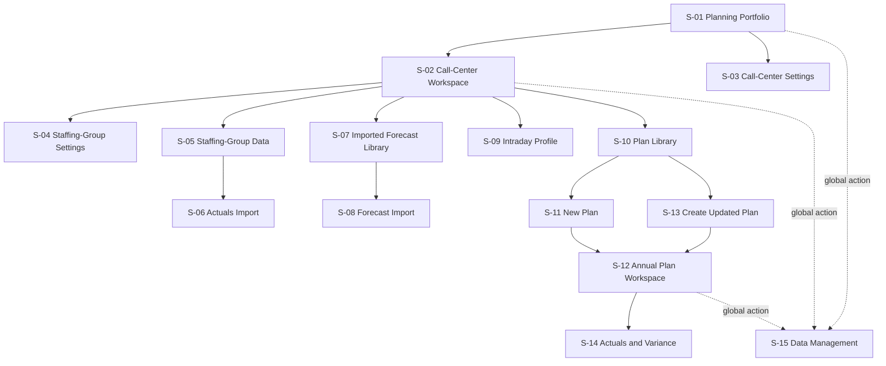
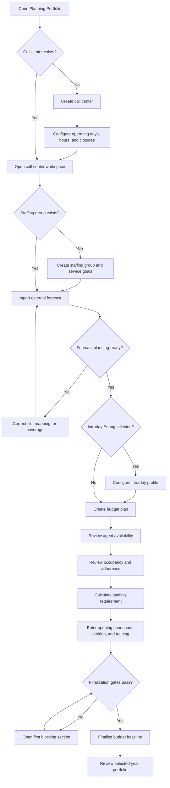
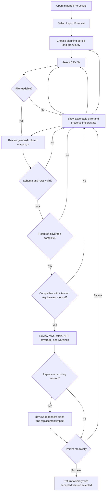
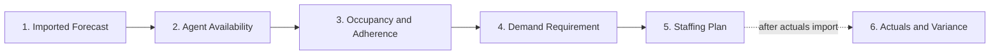
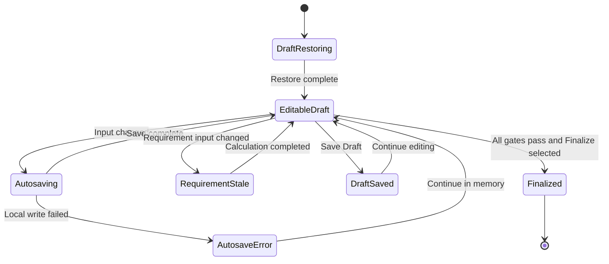
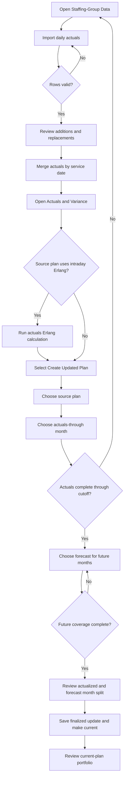
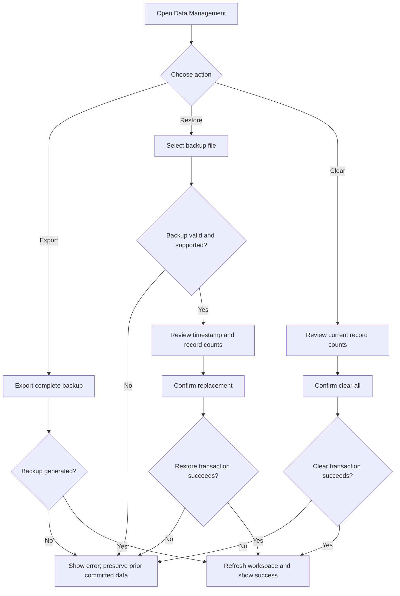

# Purpose

This supporting artifact translates the Planning Workspace specifications into a screen inventory, end-to-end workflow diagrams, and low-fidelity wireframes.

It is product-neutral and implementation-independent. Feature specifications remain authoritative when a diagram or wireframe conflicts with a requirement.

# Scope

The artifact covers:

- planning portfolio
- call-center and staffing-group setup
- daily actuals import and review
- imported forecast library and import workflow
- intraday demand profile
- plan library
- budget-plan creation and finalization
- updated-plan creation
- local backup, restore, and clearing
- empty, error, stale, and route-recovery states

It does not include:

- forecast generation or statistical-model configuration
- standalone calculators
- employee scheduling
- accounts, permissions, or collaboration

# Screen Inventory

| ID | Screen or surface | Primary purpose | Primary specifications |
|---|---|---|---|
| `S-01` | Planning Portfolio | Select year, review portfolio risk, open or create call centers | `PORT-001` through `PORT-005`, `ORG-001` |
| `S-02` | Call-Center Workspace | Select staffing groups and review selected-year center results | `ORG-001`, `ORG-003`, `PORT-002`, `PORT-003` |
| `S-03` | Call-Center Settings | Create or edit center calendar and defaults | `ORG-001`, `ORG-002` |
| `S-04` | Staffing-Group Settings | Create or edit group identity and service goals | `ORG-003` |
| `S-05` | Staffing-Group Data | Review and manage daily actuals | `ACT-001`, `ACT-002` |
| `S-06` | Actuals Import | Upload, map, validate, and merge daily actuals | `ACT-001`, `ACT-002` |
| `S-07` | Imported Forecast Library | Compare, open, import, replace, and delete versions | `FIMP-001`, `FIMP-007` |
| `S-08` | Forecast Import | Upload, map, validate, preview, and accept an external forecast | `FIMP-002` through `FIMP-006` |
| `S-09` | Intraday Profile | Define the staffing group's reusable interval distribution | `ORG-004` |
| `S-10` | Plan Library | Compare budget and update plans by year | `PLAN-001`, `ACT-004`, `ACT-006` |
| `S-11` | New Plan | Select year, requirement method, and imported forecast | `PLAN-001`, `PLAN-002`, `FIMP-008` |
| `S-12` | Annual Plan Workspace | Review assumptions, calculate requirement, and build staffing supply | `PLAN-002` through `PLAN-011` |
| `S-13` | Create Updated Plan | Choose source plan, cutoff month, and future forecast | `ACT-004`, `ACT-005` |
| `S-14` | Actuals and Variance | Compare saved plan values with observed results | `ACT-003` |
| `S-15` | Data Management | Review persisted data, export, restore, or clear | `DATA-001` through `DATA-005` |
| `S-16` | Confirmation Dialog | Confirm destructive or replacement operations | `DATA-004`, `FOUND-005` |

# Information Architecture



# Global Shell

All primary screens use a common operational shell.

```text
+----------------------------------------------------------------------------------+
| [Workspace Home]                                 [Data Management] [Navigation] |
+----------------------------------------------------------------------------------+
| Breadcrumbs                                                                       |
| Screen title                                            Context actions           |
| Short task-oriented description                        Year / scope controls     |
+----------------------------------------------------------------------------------+
| Status or error message, only when applicable                                   |
+----------------------------------------------------------------------------------+
|                                                                                  |
| Primary working area                                                             |
|                                                                                  |
+----------------------------------------------------------------------------------+
```

Global requirements:

- The screen title and selected planning scope are always visible.
- The user can reach local-data controls from every primary screen.
- Breadcrumbs communicate hierarchy but are not the only way to navigate.
- Errors, save status, restored drafts, and stale calculations appear as text.
- Primary actions remain in a consistent upper-right action area where practical.

# Workflow 1: First Budget Plan



# Workflow 2: Forecast Import



# Workflow 3: Annual Plan Workspace



The navigation is non-linear after initial setup. A planner may revisit prior sections, but dependent calculations become stale and finalization remains blocked until they are recalculated or reviewed.



# Workflow 4: Actuals and Updated Plan



# Workflow 5: Backup, Restore, and Clear



# Wireframe S-01: Planning Portfolio

```text
+----------------------------------------------------------------------------------+
| Home > Planning Portfolio                                                        |
| Planning Portfolio                   [Planning Year v] [New Center]               |
| Demand, actuals, staffing coverage, and risk for the selected year.               |
+----------------------------------------------------------------------------------+
| [Groups Planned] [Actuals Coverage] [Annual Contacts] [Average Staffing Gap]      |
+----------------------------------------------------------------------------------+
| Portfolio Monthly Operating Plan                                                  |
|----------------------------------------------------------------------------------|
| Month | Plan Contacts | Actual Contacts | Var | Plan AHT | Actual AHT | Req HC   |
| Jan   |               |                 |     |          |            |          |
| ...                                                                              |
| Dec   |               |                 |     |          |            |          |
+----------------------------------------------------------------------------------+
| Monthly Staffing Waterfall                                                        |
| [Opening] [+ Frontline Ready] [- Attrition] [Ending] [Requirement] [Roster]       |
+----------------------------------------------------------------------------------+
| Call Center Command List                                                          |
|----------------------------------------------------------------------------------|
| Center | Status | Plan Coverage | Actuals | Peak Req HC | Gap | [Open] [...]     |
+----------------------------------------------------------------------------------+
```

Key interactions:

- Changing year refreshes all metrics, tables, and charts together.
- `New Center` opens `S-03`.
- `Open` navigates to `S-02`.
- Row action menu contains edit and delete.
- Empty state replaces metrics and reports when no call centers exist.
- Partial plan coverage is stated as a fraction and not hidden inside totals.

# Wireframe S-02: Call-Center Workspace

```text
+----------------------------------------------------------------------------------+
| Planning Portfolio > North America Operations                                    |
| North America Operations                         [Year v] [Center Settings]       |
+-----------------------------+----------------------------------------------------+
| Staffing Groups             | Selected Group: Consumer Voice       [Edit Group] |
|                             | Defaults: SL 80/20 | Mon-Fri | 08:00-17:00         |
| [New Group]                 |----------------------------------------------------|
|                             | [Data] [Imported Forecasts] [Intraday] [Plans]      |
| > Consumer Voice            |----------------------------------------------------|
|   Back Office               |                                                    |
|   Sales                     | Selected staffing-group section                    |
|                             |                                                    |
|                             |                                                    |
+-----------------------------+----------------------------------------------------+
```

Key interactions:

- Left pane owns group selection and group creation.
- Right pane owns actions for the selected group.
- Year remains selected when switching sections.
- If no group exists, the right pane shows a first-group empty state.
- The right-pane action changes by section:
  - Data: `Add Data`
  - Imported Forecasts: `Import Forecast`
  - Plans: `New Plan`

# Wireframe S-03: Call-Center Settings

```text
+---------------------------------------------------------------+
| Create Call Center                                      [X]   |
| Configure the operating boundary used by staffing groups.     |
|---------------------------------------------------------------|
| Call Center Name *  [____________________________________]     |
| Time Zone           [__________________________________ v]     |
|                                                               |
| Operating Days      [x] Mon [x] Tue [x] Wed [x] Thu [x] Fri  |
|                     [ ] Sat [ ] Sun                            |
| Open Time           [08:00]   Close Time [17:00]              |
|                                                               |
| Defaults                                                      |
| Paid Hours / Day [8]  Occupancy [%] [90]  Adherence [%] [95] |
| Service Goal [%] [80]  Answer Threshold [sec] [20]            |
|                                                               |
| Holiday Year [2027 v]                      [Copy Prior Year]   |
| Date       | Closure Name                          | Actions   |
| 2027-01-01 | New Year's Day                       | [Delete]  |
| [Add Closed Date]                                            |
|---------------------------------------------------------------|
| Error or warning text                                         |
|                                           [Cancel] [Create]   |
+---------------------------------------------------------------+
```

Key interactions:

- Invalid close time appears next to the operating-hours controls.
- Replacing an existing holiday year requires `S-16`.
- Create or save remains disabled only for blocking errors.

# Wireframe S-04: Staffing-Group Settings

```text
+---------------------------------------------------------------+
| Create Staffing Group                                   [X]   |
|---------------------------------------------------------------|
| Staffing Group Name * [__________________________________]     |
|                                                               |
| Service Goal [%]       [80]                                   |
| Answer Threshold [sec] [20]                                   |
|                                                               |
| Paid Hours / Day       [8]     [Use center default]           |
| Occupancy [%]          [90]    [Use center default]           |
| Adherence [%]          [95]    [Use center default]           |
| Holiday Calendar       [Inherit from call center v]           |
|---------------------------------------------------------------|
|                                            [Cancel] [Create]   |
+---------------------------------------------------------------+
```

Key interactions:

- Inherited and overridden values are visually distinguishable.
- Removing an override restores the effective call-center value.
- Editing does not alter existing plan snapshots.

# Wireframe S-05: Staffing-Group Data

```text
+----------------------------------------------------------------------------------+
| Consumer Voice / Data                                              [Add Data] [...]|
| Daily actual contacts and handle time imported for this group.                   |
+----------------------------------------------------------------------------------+
| [Loaded Days] [Covered Years] [Total Contacts] [Weighted AHT]                    |
+----------------------------------------------------------------------------------+
| Year / Month     | Coverage | Days | Contacts | Weighted AHT | Updated | Actions |
| v 2027           | Partial  |  61  |          |              |         | [...]   |
|   Jan 2027       | 21/21    |  21  |          |              |         | [...]   |
|   Feb 2027       | 20/20    |  20  |          |              |         | [...]   |
|   Mar 2027       | 20/23    |  20  |          |              |         | [...]   |
+----------------------------------------------------------------------------------+
```

Key interactions:

- `Add Data` opens `S-06`.
- Expanding a year shows months.
- Month and year actions support confirmed scoped deletion.
- Coverage distinguishes open dates from calendar dates.

# Wireframe S-06: Actuals Import

```text
+--------------------------------------------------------------------------+
| Upload Daily Actuals                                               [X]   |
|--------------------------------------------------------------------------|
| 1. Source File                                                          |
| [ Drop CSV here or choose file ]   [Download Template]                  |
|                                                                          |
| 2. Column Mapping                                                        |
| Service Date [service_date v]                                            |
| Contacts     [contacts v]                                                |
| AHT Seconds  [average_handle_time_seconds v]                             |
|                                                                          |
| 3. Validation Summary                                                    |
| File: actuals.csv | 90 accepted rows | Jan 1-Mar 31, 2027                |
| Adds 72 dates | Replaces 18 dates                                        |
|                                                                          |
| Issues                                                                   |
| Row 42: contacts must be zero or greater.                                |
|                                                                          |
| Preview                                                                  |
| Row | Service Date | Contacts | AHT Seconds                              |
| ...                                                                      |
|--------------------------------------------------------------------------|
|                                      [Cancel] [Add Daily Actuals]        |
+--------------------------------------------------------------------------+
```

Key interactions:

- Mapping changes immediately rerun validation.
- Confirmation is disabled while blocking issues exist.
- Persistence failure preserves the file, mapping, and preview.

# Wireframe S-07: Imported Forecast Library

```text
+----------------------------------------------------------------------------------+
| Consumer Voice / Imported Forecasts                           [Import Forecast]   |
| Externally produced forecasts accepted for planning use.                         |
+----------------------------------------------------------------------------------+
| Period | Forecast Version | Granularity | Coverage | Contacts | Used By | Actions|
| 2027   | 2027 Budget v2   | Daily       | 12/12    |          | Budget  | Open...|
| 2027   | 2027 Budget v1   | Daily       | 12/12    |          | 1 plan  | Open...|
| 2027   | 2027 Monthly     | Monthly     | 12/12    |          | Not used| Open...|
+----------------------------------------------------------------------------------+
| Selected version                                                                 |
| Source file | Imported at | AHT coverage | Planning readiness | Dependencies     |
+----------------------------------------------------------------------------------+
```

Key interactions:

- No forecast-generation action appears.
- `Import Forecast` opens `S-08`.
- Row actions include rename metadata, replace source, and delete.
- Readiness is contextual: workload ratio and intraday Erlang may differ.
- Referenced-version deletion shows dependent plans in `S-16`.

# Wireframe S-08: Forecast Import

```text
+------------------------------------------------------------------------------+
| Import Forecast                                                        [X]   |
|------------------------------------------------------------------------------|
| Planning Context                                                            |
| Staffing Group: Consumer Voice                                               |
| Planning Period [2027 v]   Granularity [Daily v]                             |
| Intended Method [Workload Ratio v]                                           |
|                                                                              |
| Source File                                                                  |
| [ Drop CSV here or choose file ]       [Download Daily Template]             |
|                                                                              |
| Column Mapping                                                               |
| Service Date [date v]  Contacts [volume v]  AHT Seconds [aht_seconds v]      |
|                                                                              |
| Validation                                                                   |
| [Ready for workload-ratio planning] [Not evaluated for intraday Erlang]      |
| Coverage: 12/12 required months | 260 open dates | 0 duplicates              |
|                                                                              |
| Issues and Warnings                                                          |
| Warning: 3 rows occur on configured closed dates and will not drive plans.   |
|                                                                              |
| Preview and Summary                                                          |
| Annual Contacts | Weighted AHT | Peak Day | Earliest Date | Latest Date      |
|------------------------------------------------------------------------------|
|                                           [Cancel] [Accept Forecast]          |
+------------------------------------------------------------------------------+
```

Replacement variant:

```text
+---------------------------------------------------------------+
| Replace Imported Forecast                                    |
|---------------------------------------------------------------|
| Existing version: 2027 Budget v1                              |
| Referenced by: 2027 Budget, 2027 Apr Update                   |
|                                                               |
| Existing plans keep their saved demand snapshots.             |
| This replacement affects future selection only.               |
|---------------------------------------------------------------|
|                                    [Cancel] [Replace Version] |
+---------------------------------------------------------------+
```

# Wireframe S-09: Intraday Profile

```text
+----------------------------------------------------------------------------------+
| Consumer Voice / Intraday                                      [Save Profile]    |
| Distribute daily forecast demand across the operating window.                    |
+----------------------------------------------------------------------------------+
| Operating Window: 08:00-17:00 | Interval: 30 minutes | Total: 100.0%             |
| [Normalize to 100%] [Reset Even Distribution]                                    |
+----------------------------------------------------------------------------------+
| Interval Start | Ratio % | Visual Share                                           |
| 08:00          | [ 4.5 ] | ####                                                   |
| 08:30          | [ 5.2 ] | #####                                                  |
| ...                                                                              |
| 16:30          | [ 3.1 ] | ###                                                    |
+----------------------------------------------------------------------------------+
| Blocking message: Ratios must total 100% before the profile can be used.          |
+----------------------------------------------------------------------------------+
```

Key interactions:

- Operating-hours changes identify retained, added, and removed intervals.
- Zero-total profiles cannot be normalized.
- Save strips presentation-only values.

# Wireframe S-10: Plan Library

```text
+----------------------------------------------------------------------------------+
| Consumer Voice / Plans                                              [New Plan]   |
+----------------------------------------------------------------------------------+
| 2027                                      Current: 2027 June Update              |
|                                              [Create Updated Plan]               |
|----------------------------------------------------------------------------------|
| Plan              | Contacts | Req Hrs | Avg Req HC | Avg Gap | Vs Budget | Saved|
| 2027 Budget       |          |         |            |         | Baseline  |       |
| 2027 April Update |          |         |            |         |           |       |
| 2027 June Update  |          |         |            |         |           |       |
|                                                              [Open] [...]        |
+----------------------------------------------------------------------------------+
| 2026                                      Current: 2026 Budget                   |
| ...                                                                              |
+----------------------------------------------------------------------------------+
```

Key interactions:

- `New Plan` opens `S-11`.
- `Create Updated Plan` opens `S-13`.
- Actions include open, set current, and delete where permitted.
- Budget deletion is blocked while updates depend on it.

# Wireframe S-11: New Plan

```text
+---------------------------------------------------------------+
| New Plan                                                 [X] |
|---------------------------------------------------------------|
| Plan Name          [2027 Budget________________________]       |
| Planning Year      [2027 v]                                   |
| Requirement Method [Workload Ratio v]                          |
|                                                               |
| Imported Forecast  [2027 Budget Forecast v]                    |
| Coverage           12/12 required months                       |
| Granularity        Daily                                       |
| AHT Coverage       Complete                                    |
|                                                               |
| Starting Position                                             |
| [Inherited from 2026 current plan] or [Enter in workspace]    |
|---------------------------------------------------------------|
| Blocking message when no compatible imported forecast exists. |
|                                         [Cancel] [Create Plan] |
+---------------------------------------------------------------+
```

Key interactions:

- Forecast choices are limited to the owning staffing group.
- Monthly forecasts are excluded when intraday Erlang is selected.
- Existing same-year budget blocks creation of another budget.

# Wireframe S-12: Annual Plan Workspace

```text
+----------------------------------------------------------------------------------+
| Portfolio > Center > Group > 2027 Budget                                         |
| 2027 Budget                         Saved 10:42 AM [Save Draft] [Finalize Budget] |
+----------------------------------------------------------------------------------+
| Budget draft is editable. Next: Review Agent Availability.                       |
+-------------------------+--------------------------------------------------------+
| PLAN                    | Selected section                                       |
| Imported Forecast       |                                                        |
| Agent Availability      | Section header                         Section actions |
| Occupancy & Adherence   |                                                        |
| Demand Requirement      | Summary metrics                                        |
| Staffing Plan           |                                                        |
|-------------------------| Native monthly worksheet or focused controls           |
| ACTUALS                 |                                                        |
| Actuals & Variance      | Warnings and calculation state                         |
|                         |                                                        |
|                         | [Previous]                              [Continue]       |
+-------------------------+--------------------------------------------------------+
```

Section content:

| Section | Main content | Primary action |
|---|---|---|
| Imported Forecast | Applied source metadata, coverage, monthly demand preview | Apply selected forecast |
| Agent Availability | Monthly paid time, presence loss, utilization loss, scheduled capacity | Mark reviewed and continue |
| Occupancy and Adherence | Defaults or monthly overrides, design factor, staffing ratio | Mark reviewed and continue |
| Demand Requirement | Monthly contacts, AHT, workload, required hours and headcount | Calculate or rerun when required |
| Staffing Plan | Opening position, attrition, staffing supply, training pipeline, next-year handoff | Save draft or plan |
| Actuals and Variance | Plan versus actual demand, AHT, requirement, and staffing gap | Run actuals Erlang when required |

Finalization state:

```text
+--------------------------------------------------------------------------+
| Finalize 2027 Budget                                                     |
|--------------------------------------------------------------------------|
| Source Forecast       2027 Budget Forecast v2                            |
| Requirement Method    Workload Ratio                                     |
| Annual Contacts       1,250,000                                          |
| Average Requirement   112.4 HC                                           |
| Peak Requirement      138.7 HC                                           |
| Ending Frontline      125.0 HC                                           |
| Months Below Req.     4                                                   |
|                                                                          |
| Warnings                                                                 |
| - August ends 6.2 HC below requirement.                                  |
|                                                                          |
| Finalizing protects the budget basis from silent upstream changes.       |
|                                      [Cancel] [Finalize Budget]          |
+--------------------------------------------------------------------------+
```

# Wireframe S-13: Create Updated Plan

```text
+--------------------------------------------------------------------------+
| Create Updated Plan                                                [X]   |
|--------------------------------------------------------------------------|
| Source Plan          [2027 April Update v]                               |
| Actuals Through      [June 2027 v]                                       |
| Update Name          [2027 July Update________________________]           |
| Future Forecast      [2027 Midyear Forecast v]                           |
|                                                                          |
| Month Basis                                                              |
| Jan Feb Mar Apr May Jun | Jul Aug Sep Oct Nov Dec                        |
| [Actuals--------------] | [Imported Forecast---------------------]        |
|                                                                          |
| Validation                                                               |
| Actuals coverage: Complete through June                                  |
| Future forecast: 6/6 required months                                     |
| Lineage: 2027 Budget > 2027 April Update > New Update                    |
|--------------------------------------------------------------------------|
|                                       [Cancel] [Create Updated Plan]      |
+--------------------------------------------------------------------------+
```

# Wireframe S-14: Actuals and Variance

```text
+----------------------------------------------------------------------------------+
| Actuals and Variance                                  [Run Actuals Erlang]        |
+----------------------------------------------------------------------------------+
| [Months Loaded] [Contact Variance] [Avg AHT Variance] [Peak Actual Req HC]       |
+----------------------------------------------------------------------------------+
| Planned vs Actual Requirement Chart                                               |
+----------------------------------------------------------------------------------+
| Month | Plan Contacts | Actual | Var | Plan AHT | Actual | Plan Req | Actual Req |
| Jan   |               |        |     |          |        |          |            |
| ...                                                                              |
| Staffing Metric [Starting Frontline v] | Gap to Actual Requirement               |
+----------------------------------------------------------------------------------+
```

Key interactions:

- Intraday plans show actual requirement as unavailable until calculation completes.
- Missing months display unavailable markers.
- The selected staffing metric is named in both table and chart.

# Wireframe S-15: Data Management

```text
+--------------------------------------------------------------------------+
| Data Management                                                   [X]   |
| Stored in the planning database                                         |
|--------------------------------------------------------------------------|
| Call Centers       3       Staffing Groups    12                         |
| Annual Plans      18       Imported Forecasts 9                          |
| Planner Drafts     2       Last Updated       Jun 14, 2026              |
| Last Backup        Jun 10, 2026                                         |
|--------------------------------------------------------------------------|
| Backup                                                                  |
| Download all supported planning data.                  [Download Backup] |
|                                                                          |
| Restore                                                                 |
| Replace current planning data from a validated backup.     [Import Backup]|
|                                                                          |
| Clear Planning Data                                                    |
| Permanently remove planning records and drafts.             [Clear Data]|
+--------------------------------------------------------------------------+
```

Restore confirmation:

```text
+---------------------------------------------------------------+
| Replace Planning Data?                                        |
|---------------------------------------------------------------|
| Backup: wfmtoolkit-backup-2026-06-10.json                     |
| Exported: Jun 10, 2026 | Current format | Schema 2            |
| Scope: All local data                                         |
| Call Centers: 3 | Groups: 12 | Plans: 18 | Forecasts: 9       |
|                                                               |
| Current planning data will be replaced as one operation.      |
| Validation failure or transaction failure leaves it intact.   |
|---------------------------------------------------------------|
|                                    [Cancel] [Replace Data]    |
+---------------------------------------------------------------+
```

# Wireframe S-16: Confirmation Dialog

```text
+---------------------------------------------------------------+
| Delete Imported Forecast?                               [X]   |
|---------------------------------------------------------------|
| Delete "2027 Budget Forecast v1"?                            |
|                                                               |
| Referenced by:                                                |
| - 2027 Budget                                                 |
| - 2027 April Update                                           |
|                                                               |
| Saved plans keep their demand snapshots. The source version   |
| will no longer be available for new plans or source review.   |
|---------------------------------------------------------------|
|                             [Cancel] [Delete Forecast]         |
+---------------------------------------------------------------+
```

Confirmation rules:

- The title names the operation and affected record type.
- The body identifies cascading, replacement, or dependency impact.
- The confirm label names the destructive action.
- Cancellation is the safe default.
- A failed operation keeps the dialog context or returns an actionable error.
- Focus returns to the initiating control after cancellation.

# Common State Patterns

## Empty State

```text
+---------------------------------------------------------------+
| No imported forecasts yet                                    |
| Import an externally produced forecast before creating a plan.|
|                                             [Import Forecast] |
+---------------------------------------------------------------+
```

## Blocking Error

```text
+---------------------------------------------------------------+
| Unable to calculate requirement                               |
| July has contacts but no accepted AHT value.                  |
| Open Imported Forecasts and provide a complete source file.   |
+---------------------------------------------------------------+
```

## Stale Calculation

```text
+---------------------------------------------------------------+
| Requirement results are out of date                           |
| Service goal changed after the last intraday calculation.     |
|                                                   [Rerun]     |
+---------------------------------------------------------------+
```

## Route Recovery

```text
+---------------------------------------------------------------+
| Plan not found                                                |
| The requested plan may have been deleted from the database.   |
| Returning to Consumer Voice plans.                            |
+---------------------------------------------------------------+
```

# Screen-State Matrix

| Screen | Loading | Empty | Error | Incomplete | Stale | Read-only |
|---|---:|---:|---:|---:|---:|---:|
| Portfolio | Yes | Yes | Yes | Yes | No | No |
| Call-Center Workspace | Yes | Yes | Yes | Yes | No | No |
| Staffing-Group Data | Yes | Yes | Yes | Yes | No | No |
| Imported Forecast Library | Yes | Yes | Yes | Yes | No | No |
| Forecast Import | Yes | Yes | Yes | Yes | No | No |
| Intraday Profile | Yes | No | Yes | Yes | Yes | No |
| Plan Library | Yes | Yes | Yes | Yes | No | No |
| Annual Plan Workspace | Yes | No | Yes | Yes | Yes | Yes |
| Actuals and Variance | Yes | Yes | Yes | Yes | Yes | Yes |
| Data Management | Yes | Yes | Yes | No | No | No |

# Responsive Behavior

## Wide Screens

- `S-02` uses a persistent staffing-group master pane and selected-group detail pane.
- `S-12` uses a persistent workflow navigation column and main worksheet.
- Dense tables preserve native row and column alignment.

## Narrow Screens

- Master and detail panes stack, with selected context repeated above detail.
- Workflow navigation becomes a horizontally scrollable step strip or compact menu.
- Tables scroll horizontally instead of converting every row to a card.
- Primary actions remain reachable without hover.
- Dialogs use the available viewport and keep the action footer visible.

# Accessibility Notes

- Every screen has one primary heading.
- Tabs expose selected state.
- Selected staffing group, forecast, plan, month, and year expose programmatic state.
- Icon-only actions have accessible names that include the affected record.
- Worksheet inputs include row, measure, and unit in their accessible name.
- Error summaries link or move focus to the affected control when practical.
- Charts have textual or table equivalents.
- Destructive confirmations restore focus to the initiating action after cancellation.

# Traceability

The screen IDs map to the feature specifications in the Screen Inventory. The following foundation specifications apply to every screen:

- `FOUND-001`: product scope and terminology
- `FOUND-003`: units, dates, and numeric conventions
- `FOUND-004`: navigation and route recovery
- `FOUND-005`: UI, accessibility, worksheet, and validation standards

# Review Questions

1. Should the call-center workspace include a center-wide actuals rollup above the staffing-group master/detail area, or should all reporting remain in the portfolio?
2. Should forecast import use one adaptive dialog or separate dialogs for monthly, daily, and interval files?
3. Should the annual plan workflow permit free navigation immediately, or require first-time sequential completion?
4. Should finalization happen directly from the workspace or through the review dialog shown above?
5. Should current-plan selection be a row action or a dedicated comparison control?
6. Which tables require downloadable CSV exports in the first implementation?
